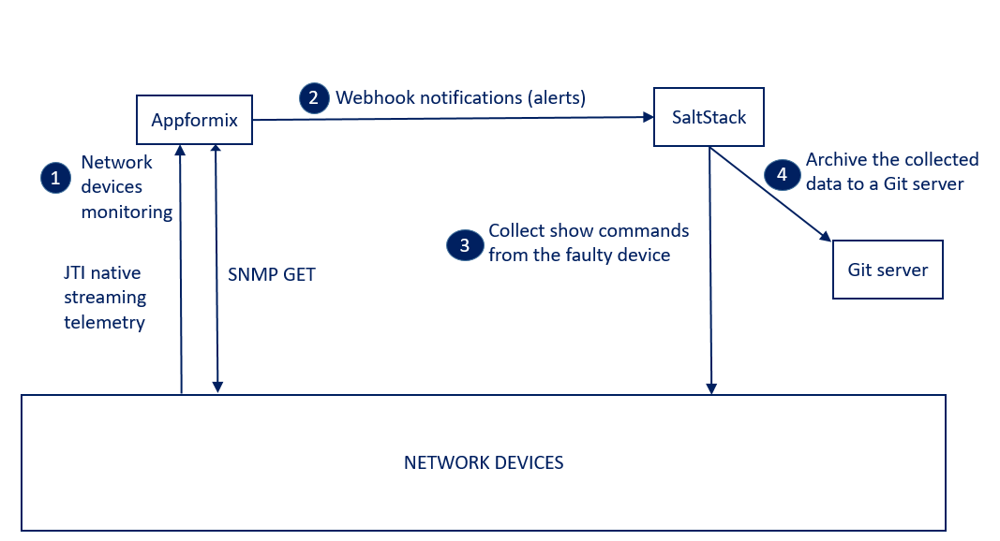

# Demo overview:  
Appformix is used for network devices monitoring.  
Appformix send webhook notifications to SaltStack.   
The webhook notifications provides the device name and other details.  
SaltStack automatically collects junos show command output on the "faulty" JUNOS device and archive the output on a Git server.    
  

# Demo building blocks: 
- Juniper devices
- Appformix
- SaltStack

# webhooks Overview: 
- A webhook is notification using an HTTP POST. A webhook is sent by a system A to push data (json body as example) to a system B when an event occurred in the system A. Then the system B will decide what to do with these details. 
- Appformix supports webhooks. A notification is generated when the condition of an alarm is observed. You can configure an alarm to post notifications to an external HTTP endpoint. AppFormix will post a JSON payload to the endpoint for each notification.
- SaltStack can listens to webhooks and generate equivalents ZMQ messages to the event bus  
- SaltStack can reacts to webhooks

# Building blocks role: 

## Appformix:  
- Collects data from Junos devices (JTI native telemetry and SNMP)  
- Generates webhooks notifications (HTTP POST with a JSON body) to SaltStack when the condition of an alarm is observed. The JSON body provides the device name and other details

## SaltStack: 
- In addition to the Salt master, Salt Junos proxy minions are required (one process per Junos device is required)  
- The Salt master listens to webhooks 
- The Salt master generates a ZMQ messages to the event bus when a webhook notification is received. The ZMQ message has a tag and data. The data structure is a dictionary, which contains information about the event.
- The Salt master listens to junos syslog messages
- The Salt master generates a ZMQ messages to the event bus when a junos syslog message is received. The ZMQ message has a tag and data. The data structure is a dictionary, which contains information about the event.
- The Salt reactor binds sls files to event tags. The reactor has a list of event tags to be matched, and each event tag has a list of reactor SLS files to be run. So these sls files define the SaltStack reactions.
- The sls reactor file used in this content does the following: it parses the data from the ZMQ message to extract the network device name. It then ask to the Junos proxy minion that manages the "faulty" device to execute an sls file.
- The sls file executed by the Junos proxy minion collects junos show commands output and archive the collected data to a git server  

## Junos devices: 
- They are monitored by Appformix
- They send syslog messages to SaltStack


# Requirements: 
- Install appformix
- Configure appformix for network devices monitoring
- Install SaltStack

# Appformix  

## Install Appformix. 
This is not covered by this documentation.  

## Configure Appformix for network devices monitoring 

Appformix supports network devices monitoring using SNMP and JTI (Juniper Telemetry Interface) native streaming telemetry.  
- For SNMP, the polling interval is 60s.  
- For JTI streaming telemetry, Appformix automatically configures the network devices. The interval configured on network devices is 60s.  

Here's the [**documentation**](https://www.juniper.net/documentation/en_US/appformix/topics/concept/appformix-ansible-configure-network-device.html)  

In order to configure AppFormix for network devices monitoring, here are the steps:
- manage the 'network devices json configuration' file. This file is used to define the list of devices you want to monitor using Appformix, and the details you want to collect from them.    
- Indicate to the 'Appformix installation Ansible playbook' which 'network devices json configuration file' to use. This is done by setting the variable ```network_device_file_name``` in ```group_vars/all```
- Set the flag to enable appformix network device monitor. This is done by setting the variable ```appformix_network_device_monitoring_enabled``` to ```true``` in ```group_vars/all```
- Enable the Appformix plugins for network devices monitoring. This is done by setting the variable ```appformix_plugins``` in ```group_vars/all```
- re run the 'Appformix installation Ansible playbook'.

Here's how to manage the 'network devices json configuration file' with automation:  
Define the list of devices you want to monitor using Appformix, and the details you want to collect from them:    
```
vi configure_appformix/network_devices.yml
```

Execute the python script [**network_devices.py**](configure_appformix/network_devices.py). It renders the template [**network_devices.j2**](configure_appformix/network_devices.j2) using the variables [**network_devices.yml**](configure_appformix/network_devices.yml). The rendered file is [**network_devices.json**](configure_appformix/network_devices.json).  
```
python configure_appformix/network_devices.py
```
```
more configure_appformix/network_devices.json
```

From your appformix directory, update ```group_vars/all``` file: 
```
cd appformix-2.15.2/
vi group_vars/all
```
to make sure it contains this:
```
network_device_file_name: /path_to/network_devices.json
appformix_network_device_monitoring_enabled: true
appformix_jti_network_device_monitoring_enabled: true
appformix_plugins:
   - plugin_info: 'certified_plugins/jti_network_device_usage.json'
   - plugin_info: 'certified_plugins/snmp_network_device_routing_engine.json'
   - plugin_info: 'certified_plugins/snmp_network_device_usage.json'
```

Then, from your appformix directory, re-run the 'Appformix installation Ansible playbook':
```
cd appformix-2.15.2/
ansible-playbook -i inventory appformix_standalone.yml
```
## Configure the network devices with the SNMP community used by Appformix

You need to configure the network devices with the SNMP community used by Appformix. The script [**snmp.py**](configure_junos/snmp.py) renders the template [**snmp.j2**](configure_junos/snmp.j2) using the variables [**network_devices.yml**](configure_appformix/network_devices.yml). The rendered file is [**snmp.conf**](configure_junos/snmp.conf). This file is then loaded and committed on all network devices used with SNMP monitoring.
 
```
python configure_junos/snmp.py
configured device 172.30.52.85 with snmp community public
configured device 172.30.52.86 with snmp community public
```
```
more configure_junos/snmp.conf
```

## Configure the network devices for JTI telemetry

For JTI native streaming telemetry, Appformix uses NETCONF to automatically configure the network devices:  
```
lab@vmx-1-vcp> show system commit
0   2018-03-22 16:32:37 UTC by lab via netconf
1   2018-03-22 16:32:33 UTC by lab via netconf
```
```
lab@vmx-1-vcp> show configuration | compare rollback 1
[edit services analytics]
+    sensor Interface_Sensor {
+        server-name appformix-telemetry;
+        export-name appformix;
+        resource /junos/system/linecard/interface/;
+    }
```
```
lab@vmx-1-vcp> show configuration | compare rollback 2
[edit]
+  services {
+      analytics {
+          streaming-server appformix-telemetry {
+              remote-address 172.30.52.157;
+              remote-port 42596;
+          }
+          export-profile appformix {
+              local-address 192.168.1.1;
+              local-port 21112;
+              dscp 20;
+              reporting-rate 60;
+              format gpb;
+              transport udp;
+          }
+          sensor Interface_Sensor {
+              server-name appformix-telemetry;
+              export-name appformix;
+              resource /junos/system/linecard/interface/;
+          }
+      }
+  }

lab@vmx-1-vcp>
```
Run this command to show the installed sensors: 
```
lab@vmx-1-vcp> show agent sensors
```

If Appformix has serveral ip addresses, and you want to configure the network devices to use a different IP address than the one configured by appformix for telemetry server, execute the python script [**telemetry.py**](configure_junos/telemetry.py). 
The python script [**telemetry.py**](configure_junos/telemetry.py) renders the template [**telemetry.j2**](configure_junos/telemetry.j2) using the variables [**network_devices.yml**](configure_appformix/network_devices.yml). The rendered file is [**telemetry.conf**](configure_junos/telemetry.conf). This file is then loaded and committed on all network devices used with JTI telemetry.  

```
more configure_appformix/network_devices.yml
```
```
python configure_junos/telemetry.py
configured device 172.30.52.155 with telemetry server ip 192.168.1.100
configured device 172.30.52.156 with telemetry server ip 192.168.1.100
```
```
# more configure_junos/telemetry.conf
set services analytics streaming-server appformix-telemetry remote-address 192.168.1.100
```
Verify on your network devices: 
```
lab@vmx-1-vcp> show configuration services analytics streaming-server appformix-telemetry remote-address
remote-address 192.168.1.100;

lab@vmx-1-vcp> show configuration | compare rollback 1
[edit services analytics streaming-server appformix-telemetry]
-    remote-address 172.30.52.157;
+    remote-address 192.168.1.100;

lab@vmx-1-vcp> show system commit
0   2018-03-23 00:34:47 UTC by lab via netconf

```
```
lab@vmx-1-vcp> show agent sensors

Sensor Information :

    Name                                    : Interface_Sensor
    Resource                                : /junos/system/linecard/interface/
    Version                                 : 1.1
    Sensor-id                               : 150000323
    Subscription-ID                         : 562950103421635
    Parent-Sensor-Name                      : Not applicable
    Component(s)                            : PFE

    Server Information :

        Name                                : appformix-telemetry
        Scope-id                            : 0
        Remote-Address                      : 192.168.1.100
        Remote-port                         : 42596
        Transport-protocol                  : UDP

    Profile Information :

        Name                                : appformix
        Reporting-interval                  : 60
        Payload-size                        : 5000
        Address                             : 192.168.1.1
        Port                                : 21112
        Timestamp                           : 1
        Format                              : GPB
        DSCP                                : 20
        Forwarding-class                    : 255

```

# SaltStack 

## Install the master and a minion and junos proxy
This is not covered by this documentation.

## Salt master configuration file 

ssh to the Salt master and open the salt master configuration file:
```
more /etc/salt/master
```

Make sure the master configuration file has these details:
```
engines:
  - junos_syslog:
      port: 516
  - webhook:
      port: 5001
```
```
ext_pillar:
  - git:
    - master git@gitlab:organization/network_parameters.git
```
```
fileserver_backend:
  - git
  - roots
```
```
gitfs_remotes:
  - ssh://git@gitlab/organization/network_model.git
```
```
file_roots:
  base:
    - /srv/salt
    - /srv/local
```
So:
- the Salt master is listening webhooks on port 5001. It generates equivalents ZMQ messages to the event bus
runners are in the directory /srv/runners on the Salt master
- the Salt master is listening junos syslog messages on port 516. It generates equivalents ZMQ messages to the event bus
- external pillars are in the gitlab repository organization/network_parameters  (master branch)
- Salt uses the gitlab repository organization/network_model.git this github repository as a remote file server.  
- Salt uses the directories /srv/salt and /srv/local on the master as a remote file server.  


## SaltStack Git execution module basic demo

ssh to the Salt master.

On the Salt master, list all the keys.
```
salt-key -L
```
These commands are run from the master.   
Most of these commands are using the Git execution module.   
So the master is asking to the minion ```core-rtr-p-01``` to execute these commands.    
```
# salt core-rtr-p-01 git.clone /tmp/local_copy git@github.com:JNPRAutomate/appformix_saltstack_show_commands_collection.git identity="/root/.ssh/id_rsa"
core-rtr-p-01:
    True

# salt core-rtr-p-01 cmd.run "ls /tmp/local_copy"
core-rtr-p-01:
    README.md
    collect_junos_show_commands.sls
    ...

# salt core-rtr-p-01 git.config_set user.email me@example.com cwd=/tmp/local_copy
core-rtr-p-01:
    - me@example.com

# salt core-rtr-p-01 git.config_set user.name ksator cwd=/tmp/local_copy
core-rtr-p-01:
    - ksator
    
# salt core-rtr-p-01 git.config_get user.name cwd=/tmp/local_copy
core-rtr-p-01:
    ksator

# salt core-rtr-p-01 git.pull /tmp/local_copy
core-rtr-p-01:
    Already up-to-date.

# salt core-rtr-p-01 file.touch "/tmp/local_copy/test.txt"
core-rtr-p-01:
    True

# salt core-rtr-p-01 file.write "/tmp/local_copy/test.txt" "hello from SaltStack using git executiom module"
core-rtr-p-01:
    Wrote 1 lines to "/tmp/local_copy/test.txt"

# salt core-rtr-p-01 cmd.run "more /tmp/local_copy/test.txt"
core-rtr-p-01:
    ::::::::::::::
    /tmp/local_copy/test.txt
    ::::::::::::::
    hello from SaltStack using git executiom module

# salt core-rtr-p-01 git.status /tmp/local_copy
core-rtr-p-01:
    ----------
    untracked:
        - test.txt

# salt core-rtr-p-01 git.add /tmp/local_copy /tmp/local_copy/test.txt
core-rtr-p-01:
    add 'test.txt'

# salt core-rtr-p-01 git.status /tmp/local_copy
core-rtr-p-01:
    ----------
    new:
        - test.txt

# salt core-rtr-p-01 git.commit /tmp/local_copy 'The commit message'
core-rtr-p-01:
    [master 60f5943] The commit message
     1 file changed, 1 insertion(+)
     create mode 100644 test.txt

# salt core-rtr-p-01 git.status /tmp/local_copy
core-rtr-p-01:
    ----------

# salt core-rtr-p-01 git.push /tmp/local_copy origin master identity="/root/.ssh/id_rsa"
core-rtr-p-01:
```
The above commands pushed the file [test.txt](test.txt) to this repository  

## Test your Junos proxy daemons

ssh to the Salt master.

On the Salt master, list all the keys. 
```
# salt-key -L
```
Run this command to check if the minions are up and responding to the master. This is not an ICMP ping.
```
# salt -G 'roles:minion' test.ping
```
```
# salt core-rtr-p-01 test.ping
core-rtr-p-01:
    True
```
List the grains: 
```
# salt core-rtr-p-01 grains.ls
...
```
Get the value of the grain nodename. 
```
# salt core-rtr-p-01 grains.item nodename
core-rtr-p-01:
    ----------
    nodename:
        svl-util-01
```
So, the junos proxy daemon ```core-rtr-p-01``` is running on the minion ```svl-util-01```  

The Salt Junos proxy has some requirements (junos-eznc python library and other dependencies).
```
# salt svl-util-01 cmd.run "pip list | grep junos"
svl-util-01:
    junos-eznc (2.1.7)
```
### Junos execution modules

Run this command on the master to ask to a proxy to use a Junos execution module:   
```
# salt core-rtr-p-01 junos.cli "show chassis hardware"
core-rtr-p-01:
    ----------
    message:

        Hardware inventory:
        Item             Version  Part number  Serial number     Description
        Chassis                                VM5AA80D5BB2      VMX
        Midplane
        Routing Engine 0                                         RE-VMX
        CB 0                                                     VMX SCB
        FPC 0                                                    Virtual FPC
          CPU            Rev. 1.0 RIOT-LITE    BUILTIN
          MIC 0                                                  Virtual
            PIC 0                 BUILTIN      BUILTIN           Virtual
    out:
        True
```
### Junos state modules 

The files [collect_junos_show_commands_example_1.sls](collect_junos_show_commands_example_1.sls) and [collect_junos_show_commands_example_2.sls](collect_junos_show_commands_example_2.sls) use a diff syntax but they are equivalents.  

#### Syntax 1

```
# more /srv/salt/collect_junos_show_commands_example_1.sls
show version:
  junos:
    - cli
    - dest: /tmp/show_version.txt
    - format: text
show chassis hardware:
  junos:
    - cli
    - dest: /tmp/show_chassis_hardware.txt
    - format: text
```
Run this command on the master to ask to the proxy core-rtr-p-01 to execute the sls file  [collect_show_commands_example_1.sls](collect_show_commands_example_1.sls).
```
# salt core-rtr-p-01 state.apply collect_show_commands_example_1
```

#### Syntax 2
```
# more /srv/salt/collect_show_commands_example_2.sls
show_version:
  junos.cli:
    - name: show version
    - dest: /tmp/show_version.txt
    - format: text
show_chassis_hardware:
  junos.cli:
    - name: show chassis hardware
    - dest: /tmp/show_chassis_hardware.txt
    - format: text
```
Run this command on the master to ask to the proxy core-rtr-p-01 to execute the sls file  [collect_show_commands_example_2.sls](collect_show_commands_example_2.sls).
```
# salt core-rtr-p-01 state.apply collect_show_commands_example_2
```
## sls file to collect junos show commands and to archive the output to git

This sls file [collect_data_and_archive_to_git.sls](collect_data_and_archive_to_git.sls) collectes data from junos devices (show commands) and archive the data collected on a git server  

Add this file in the ```junos``` directory of the ```organization/network_model``` repository (```gitfs_remotes```) .  

## Pillars 

Here's an example for the ```top.sls``` file at the root of the gitlab repository ```organization/network_parameters``` (```ext_pillar```)  
```
 
 

base:
  '*':
    - production
   

  '{{ id }}':
    - {{ id }}

```

The pillar ```data_collection``` is used by the file [collect_data_and_archive_to_git.sls](collect_data_and_archive_to_git.sls)  
Update the file ```production.sls``` in the repository ```organization/network_parameters``` (```ext_pillar```) to define the pillar ```data_collection``` 
```
data_collection:  
   - command: show interfaces  
   - command: show chassis hardware
   - command: show version   
   - command: show configuration
```

## Test your automation content manually from the master

Example with the proxy ```core-rtr-p-02``` (it manages the network device ```core-rtr-p-02```).   
Run this command on the master to ask to the proxy ```core-rtr-p-01``` to execute it.  
```
salt core-rtr-p-01 state.apply junos.collect_data_and_archive_to_git
```

The data collected by the proxy ```core-rtr-p-01``` is archived in the directory [core-rtr-p-01](core-rtr-p-01)  


##  Update the Salt reactor

Update the Salt reactor file  
The reactor binds sls files to event tags. The reactor has a list of event tags to be matched, and each event tag has a list of reactor SLS files to be run. So these sls files define the SaltStack reactions.  
Update the reactor.  
This reactor binds ```salt/engines/hook/appformix_to_saltstack``` to ```/srv/reactor/automate_show_commands.sls``` 
```
# more /etc/salt/master.d/reactor.conf
reactor:
   - 'salt/engines/hook/appformix_to_saltstack':
       - /srv/reactor/automate_show_commands.sls
```

Restart the Salt master:
```
service salt-master stop
service salt-master start
```

The command ```salt-run reactor.list``` lists currently configured reactors:  
```
salt-run reactor.list
```

Create the sls reactor file ```/srv/reactor/automate_show_commands.sls```.  
It parses the data from the ZMQ message that has the tags ```salt/engines/hook/appformix_to_saltstack``` and extracts the network device name.  
It then ask to the Junos proxy minion that manages the "faulty" device to apply the ```junos/collect_data_and_archive_to_git.sls``` file.  
the ```junos/collect_data_and_archive_to_git.sls``` file executed by the Junos proxy minion collects show commands from the "faulty" device and archive the data collected to a git server. 

```
# more /srv/reactor/automate_show_commands.sls


automate_show_commands:
  local.state.apply:
    - tgt: "{{ devicename }}"
    - arg:
      - junos.collect_data_and_archive_to_git
```

# Run the demo: 

## Create Appformix webhook notifications.  

You can do it from Appformix GUI, settings, Notification Settings, Notification Services, add service.    
Then:  
service name: appformix_to_saltstack  
URL endpoint: provide the Salt master IP and Salt webhook listerner port (```HTTP://192.168.128.174:5001/appformix_to_saltstack``` as example).  
setup  

## Create Appformix alarms, and map these alarms to the webhook you just created.

You can do it from the Appformix GUI, Alarms, add rule.  
Then, as example:   
Name: in_unicast_packets_core-rtr-p-02,  
Module: Alarms,  
Alarm rule type: Static,  
scope: network devices,  
network device/Aggregate: core-rtr-p-02,  
generate: generate alert,  
For metric: interface_in_unicast_packets,  
When: Average,  
Interval(seconds): 60,  
Is: Above,  
Threshold(Packets/s): 300,  
Severity: Warning,  
notification: custom service,  
services: appformix_to_saltstack,  
save.

## Watch webhook notifications and ZMQ messages  

Run this command on the master to see webhook notifications:
```
# tcpdump port 5001 -XX 
```

Salt provides a runner that displays events in real-time as they are received on the Salt master:  
```
# salt-run state.event pretty=True
```

## Trigger an alarm  to get a webhook notification sent by Appformix to SaltStack 

Either you DIY, or, depending on the alarms you set, you can use one the automation content available in the directory [trigger_alarms](trigger_alarms).  
Here's how to use the automation content available in the directory [trigger_alarms](trigger_alarms).  

### generate traffic between 2 routers 
Add the file [generate_traffic.sls](trigger_alarms/generate_traffic.sls) to the directory ```junos``` of the gitlab repository ```organization/network_model``` (```gitfs_remotes```).  

And run this command on the master:   
```
# salt "core-rtr-p-02" state.apply junos.generate_traffic
```
### Change interface speed on a router

Add the file [change_int_speed.sls](trigger_alarms/change_int_speed.sls) to the directory ```junos``` of the gitlab repository ```organization/network_model``` (```gitfs_remotes```).  
Add the file [speed.set](trigger_alarms/speed.set) to the directory ```template``` of the gitlab repository ```organization/network_model``` (```gitfs_remotes```).    
Run this command on the master:   
```
# salt "core-rtr-p-02" state.apply junos.change_int_speed
# salt "core-rtr-p-02" junos.cli "show system commit"
# salt "core-rtr-p-02" junos.cli "show configuration | compare rollback 1"
# salt "core-rtr-p-02" junos.cli "show configuration interfaces ge-0/0/1"
```

### Change MTU on a router

Add the file [change_mtu.sls](trigger_alarms/change_mtu.sls) to the directory ```junos``` of the gitlab repository ```organization/network_model``` (```gitfs_remotes```).  
Add the file [mtu.set](trigger_alarms/mtu.set) to the directory ```template``` of the gitlab repository ```organization/network_model``` (```gitfs_remotes```).    
Run this command on the master:   
```
# salt "core-rtr-p-02" state.apply junos.change_mtu
# salt "core-rtr-p-02" junos.cli "show system commit"
# salt "core-rtr-p-02" junos.cli "show configuration | compare rollback 1"
# salt "core-rtr-p-02" junos.cli "show configuration interfaces ge-0/0/1"
```

## Verify on the git server 

The data collected by the proxy ```core-rtr-p-01```  is archived in the directory [core-rtr-p-01](core-rtr-p-01)  
The data collected by the proxy ```core-rtr-p-02```  is archived in the directory [core-rtr-p-02](core-rtr-p-02)

